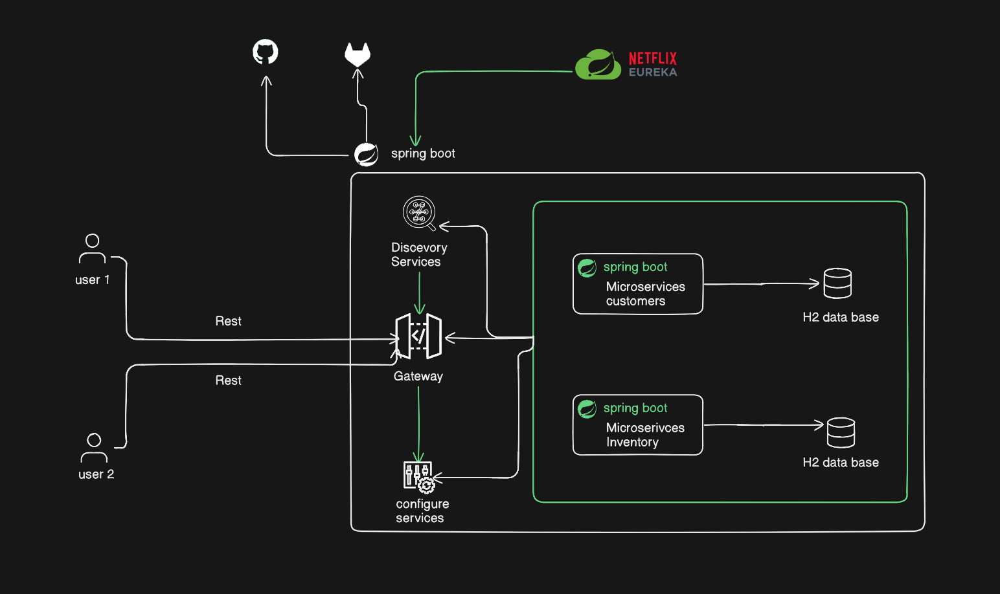
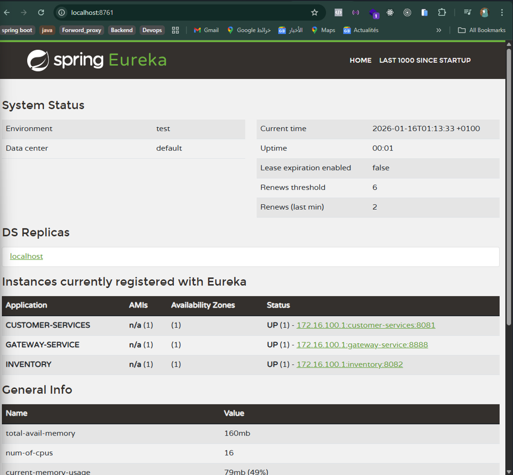
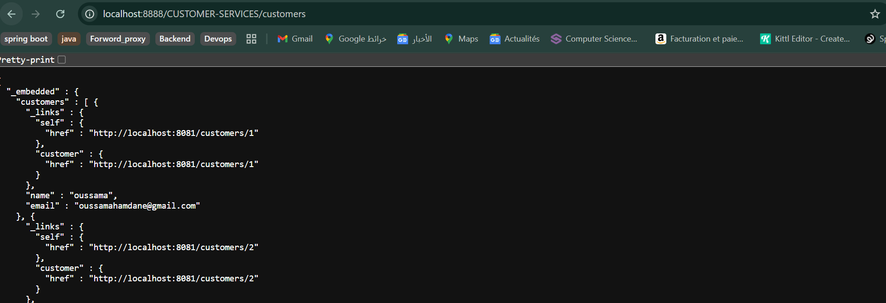

# 🧩 Microservices Architecture with Spring Boot

This project is my **first mini-project** based on a **microservices architecture**, developed using **Spring Boot**.  
It helped me understand the fundamental concepts of microservices, their communication, and monitoring.

---

## 📌 Project Objectives

- Implement a **microservices architecture**
- Understand **separation of concerns** between services
- Build **REST APIs**
- Implement **microservices monitoring**
- Explore the **Spring Boot / Spring Cloud** ecosystem

---

## 🏗️ Project Architecture

Below is the overall architecture of the project:

---

## ▶️ Project Demonstration

This screenshot shows a demonstration of the project’s overall functionality:

---

## 📊 Microservices Monitoring

The project includes a **monitoring system** to track the health and performance of the microservices:

---

## 👥 Customers Microservice

The **Customers** microservice is responsible for managing customer data.  
It allows displaying a list of existing customers.

Example output:

---

## 📦 Products Microservice

The **Products** microservice is responsible for managing products.  
It provides a REST API to retrieve the list of available products.

---

## ⚙️ Technologies Used

- **Java**
- **Spring Boot**
- **Spring Cloud**
- **REST APIs**
- **Microservices Architecture**
- **Microservices Monitoring**

---

## 🚀 Skills Gained

Through this project, I was able to:
- Understand **microservices architecture**
- Design and organize multiple independent services
- Build **RESTful APIs**
- Manage inter-service communication
- Implement **monitoring**
- Strengthen my skills in **Spring Boot**
